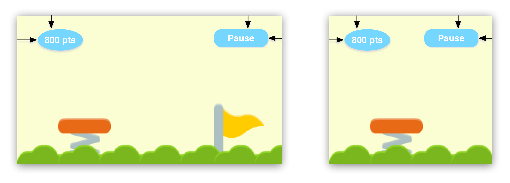
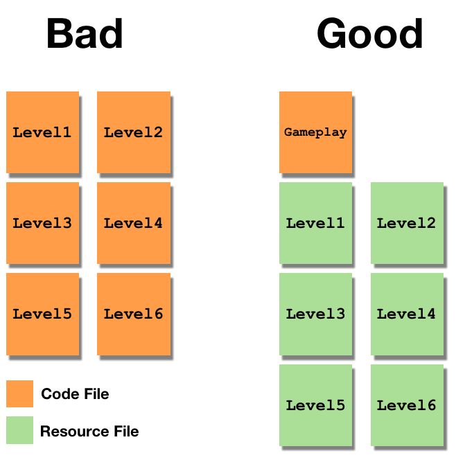
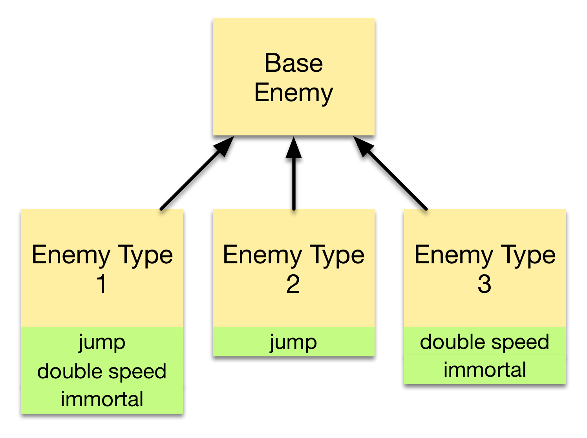
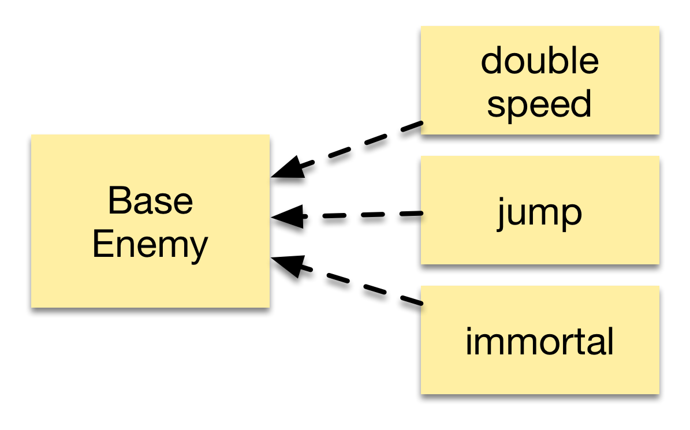

---
title: 5 Best practices for mobile game development
slug: best-practices
--- 

This article was created in preparation of a Codementor office hour. 
It discusses 5 best practices for game development that can help you avoid common mistakes.

##1. Don't make assumptions about the screen size

Even if you develop your game for iOS only it will run on a vast amount of different devices. The days in which you know the exact screen dimensions under which your game will operate are finally over. Luckily things aren't as bad as trying to make a website look good on all possible devices (think Computers, Smartphones, Televisions, Watches) but we need to put some thought into designing for multiple screen sizes.

The first rule is: **never** use constant numbers to represent the screen size. It's a bad sign if you see something similar to this in your code:
	
	screenWidth = 320
	myButton.x  = screenWidth - 50
	
You should always position your nodes relative to a value that corresponds to the screen size. In Cocos2D for example, the relevant value is the content size of the scene:

	myButton.x = self.contentSize.width - 50
	
If you follow this basic rule you have already avoided a majority of the problems that occur when assuming some constant number for the screen size. 

What else should you think about? Typically I try to divide the content on the screen into two categories: UI elements and gameplay elements. Example for UI elements are a pause button, a highscore display, basically anything that is not part of the core gameplay. I usually place all of these UI elements relative to the screen edges:  

This way the UI is usable on all different device sizes. For resizing the actual gameplay there is no silver bullet. In a sidescroller for example it will mostly be acceptable to shower a smaller portion of the game on a smaller device, just as in the example image above.

In a puzzle game with a fixed size grid that is not possible. Here you will have to make the grid work on the smallest device you support. On larger screens you can scale that grid and potentially present additional information that is *nice to have* but not required for the core gameplay.

##2. Separate game mechanics from game content

Your game mechanics should be modeled in code, your game content should be modeled in resource files. This is especially important for level based games and other content rich games (e.g. quiz games). Tools like [SpriteBuilder](spritebuilder.com) can make it easier to keep these two parts of your game separate.

If you don't follow this rule of separation you will end up with a lot of redundant code. A typical bad sign is having classes in code for each individual level:

- Level1
- Level2
- Level3
- ...

A general rule of Software Development is that each module of code should only contain functionality that is specific to it. In most games your individual levels will not have *any* specific behavior, so you won't need classes to represent them. Instead for most simple games you should end up with a gameplay class that implements the core mechanics of your game and a resource file for each individual level:

What types of resource files should you use? For games like jump and run platformers, which can have visually complex levels, I recommend using SpriteBuilder and creating one CCB File (SpriteBuilder's scene file) for each level. If you are building a quiz game or a text adventure you should use a resource file that allows you to structure information easily. On iOS [property lists](https://developer.apple.com/library/mac/documentation/Cocoa/Conceptual/PropertyLists/QuickStartPlist/QuickStartPlist.html#//apple_ref/doc/uid/10000048i-CH4-SW5) are a great type of structured resource file. Xcode provides a nice plist editor and iOS has built in parsers to generate dictionaries and arrays from plists. There are many other types of structured resource file such as XML and JSON. I recommend using property lists except you need a feature that they don't support.

If you strictly separate game code from game content you gain some more advantages: level designers can create new levels without modifying the game code and you can easily create content that can be added to the game dynamically, after you have shipped it.

The right mindset is the most important. Try to think through what your game would look like on different screen sizes and avoid constants for screen width and screen height.

##3. Use the update loop for time dependent actions

In many games you will have actions that repeat themselves in a defined time interval. For example you might have a game that spawns enemies every couple of seconds. When working with timed actions like these it is important to understand the concept of the *update loop*. 

Most game engines render the game scene to the screen at a certain interval, e.g. 60 times a second. These game engines have an internal timer to determine when a frame should be rendered.

When working with such a game engine it is important that you don't set up your own timers for your timed actions but instead use the timer of the game engine. Why? It can happen that the game engine is not able to render your game at 60 FPS, then your game will slow down.

If you set up your own timers they will keep running at the predefined speed while your main gameplay is running slower - different parts of your game will get out of sync.

In Cocos2D there are different pretty straightforward ways to integrate your custom timed events with the update loop. You can implement a method called *update* that is called before every frame is rendered; you can also use the *schedule* method to tell Cocos2D to call a method at a certain interval. Both methods use the timer of Cocos2D's *update loop*.

Whatever game engine you use, make sure your timers are integrated with the update loop!

##4. Use composition to share behavior between different classes

Imagine a game where you have 20 different types of enemies. Each of them have some behavior in common (they can loose energy, they can switch to immortal mode) and they have some specific characteristics (one can jump, another one can move at double speed). 

How could you model this game in code? One approach would be creating an enemy class with the common behavior and 20 subclasses that each have their specific behavior. But what if some of these enemies are very similar sharing 4 out of 5 characteristics? Take a look at the following example inheritance diagram:

You can see that all methods that are shared between different enemy types (e.g.. jump) are duplicated. You could try improving this a little by creating a different hierarchy of subclasses - but without multiple inheritance we cannot avoid a situation with duplicated code.

One common way to solve this problem is using *Composition* instead of *Inheritance*. We can implement the specific characteristics, e.g. *jump*, *move at double speed*, *immortality* each in a separate class. In this pattern these classes are typically called *Components*. Then we can create all possible enemy types by creating an instance of the base class along with the components we want to have. That way we can create all different types of enemies by combining components instead of creating subclasses:

  

Creating a new enemy type could look somewhat like this:

    jumpComponent = JumpComponent()
    immortalityComponent = ImmortalityComponent()
    enemy = Enemy(jumpComponent, immortalityComponent)
    
One last question we should discuss is how these components are implemented. A *jump* component for example will need a way to actually move the enemy object it belongs to. In most simple cases it is sufficient to have a bunch of public variables on the class that owns the components. These variables include anything that can be changed by components (e.g. speed, position, health, etc.). Each component gets a reference to the object it belongs to and can read and modify these public variables. There are many different ways how to implement this pattern, you can read a great and extensive discussion in the [Game Programming Patterns Book](http://gameprogrammingpatterns.com/component.html).

This is one of the patterns that I believe are useful early on in a game developer career!

##5. Use factory methods to create objects that use composition

This last best practice simply builds on top of the composition pattern. You probably realized that creating enemy instances became more complex using the pattern. If we had individual subclasses for each enemy type, creating an enemy of a specific type would look like this:

     // enemy with jump and immortality behavior
     enemy = EnemyType1()
     
Instead, when using components we need to know which components are required for a certain enemy type:

    jumpComponent = JumpComponent()
    immortalityComponent = ImmortalityComponent()
    enemy = Enemy(jumpComponent, immortalityComponent)
    
Using the factory pattern we can hide this complexity behind simpler methods. The factory pattern was originally described in the famous *Design Patterns* book. Applied to our example we could come up with the following factory methods:

    func createEnemyType1 -> Enemy {
      jumpComponent = JumpComponent()
      immortalityComponent = ImmortalityComponent()
      enemy = Enemy(jumpComponent, immortalityComponent)
    }
    
    func createEnemyType2 -> Enemy {
      immortalityComponent = ImmortalityComponent()
      enemy = Enemy(immortalityComponent)
    }
    
Now we have a simple interface for creating different enemy types and our enemies consist of reusable components, great!
I hope you enjoyed these best practices, they should help you avoid some common mistakes.